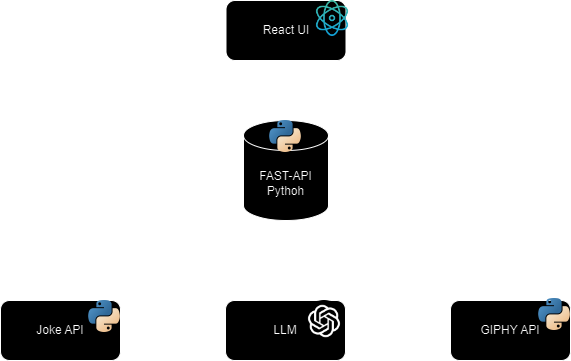

# GIF Meme Generator with Python Fast-API, React and LLM

This project is a **React web application** that combines jokes with relevant GIFs to create a fun and humorous experience. It uses a **Python FastAPI backend** to fetch jokes, analyze them, and retrieve GIFs that match the joke's punchline or main theme.

## Key Features
- **Jokes & GIFs**: The app fetches jokes from a Joke API and finds matching GIFs from Giphy for an entertaining visual experience.
- **LLM-Powered Matching**: A Language Learning Model (LLM) analyzes each joke to extract the most important word, which is used to retrieve a suitable GIF from the Giphy API.
- **React Frontend**: The frontend, built with React, displays the joke alongside its corresponding GIF in a user-friendly interface.

## How it Works
1. **Backend (FastAPI)**:
   - Fetches jokes from a Joke API.
   - Uses an LLM to determine the key word in the joke.
   - Sends the key word to the Giphy API to get a matching GIF.
2. **Frontend (React)**:
   - Displays the joke and its corresponding GIF fetched from the backend.

Enjoy a fun and dynamic joke experience powered by AI and GIFs!

## System Design



## Example Joke


## How to start with Docker-Compose

1. Clone repository 

```bash
git clone https://github.com/GermanPaul12/Gif-Meme-Generator-React-Fast-API-LLM.git
```

2. Change directory 

```bash
cd Gif-Meme-Generator-React-Fast-API-LLM/
```

4. Create `.env` file  

```bash
touch .env
```

5. Get yourself a GIPHY API key: https://developers.giphy.com/explorer/

6. Get yourself a GROQ API key: https://console.groq.com/keys

7. Add your API Keys to the `.env` file. Content of .env should look like:

```txt
GIPHY_API_KEY=<YOUR KEY>
GROQ_API_KEY=<YOUR KEY>
```

8. Start docker-compose

```bash
docker-compose up -d 
```

9. Access web-application `http://localhost:5167`

## How to make this project work locally without docker

1. Clone repository 

```bash
git clone https://github.com/GermanPaul12/Gif-Meme-Generator-React-Fast-API-LLM.git
```

2. Change directory 

```bash
cd Gif-Meme-Generator-React-Fast-API-LLM/
```

3. Install dependencies 
   
```bash
pip install -r requirements.txt
```

4. Create `.env` file  

```bash
touch .env
```

5. Get yourself a GIPHY API key: https://developers.giphy.com/explorer/

6. Get yourself a GROQ API key: https://console.groq.com/keys

7. Add your API Keys to the `.env` file. Content of .env should look like:

```txt
GIPHY_API_KEY=<YOUR KEY>
GROQ_API_KEY=<YOUR KEY>
```

8. Change directory

```bash
cd fastapi-react/
```

9. Open two terminals inside `fastapi-react` directory

```bash
cd Gif-Meme-Generator-React-Fast-API-LLM/fastapi-react/
```

10. Start Fast-Api backend in first terminal

```bash
cd backend/
python3 main.py
```

1. Start React Web-App in second terminal

```bash
cd frontend/
npm run dev
```

9. Access the web-application `http://localhost:5173`
